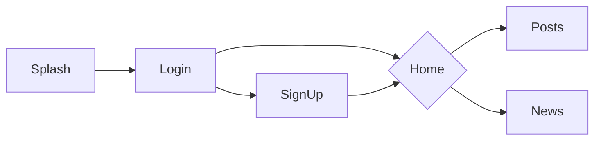

# gb.tech_.blogging

---

Repositório resultado do desafio técnico


## Objetivo

Implementar um microblogging onde os colaboradores possam compartilhar ideias e pensamentos do dia a dia e saber
das últimas novidades do Grupo Boticário.

## Arquitetura

Foi aplicada uma arquitetura limpa com o código organizado em pastas:

|Nome da Pasta|Conteúdo|
|:--|:--|
|domain| Entidades e definição de interfaces|
|application| Casos de uso|
|infra| Implementações das interfaces, adaptadores, frameworks e drivers |
|presenter| Entradas, saídas e interações da aplicação|

## Testes

O projeto contém testes de unidade, integração e widget, para executar utilize o comando ```flutter test```

## Design System
Foi criado um package __gbtech_blogging_ds__ permitindo assim que seja reutilizado em outros projetos:

|Nome da Pasta| Conteúdo|
|:--|:--|
|tokens| colors, spacings, typography|
|components| button, textField|
|patterns| card, input |


## Telas e navegação


|Nome da Tela| Conteúdo|
|:--|:--|
|Splash| Icone, nome do aplicativo e informações do desenvolvedor |
|Login| Inputs de e-mail e senha, botão entrar e botão cadastre-se |
|SignUp| Inputs de nome, e-mail, senha, botão continuar|
|Home| Navegação para telas de postagens e novidades|
|Posts| Lista de postagens e input para novo post |
|News|Lista das últimas novidades do Boticário|

## Resultado

Desenvolvimento em progresso...
<!-- TODO: adicionar video ou gif com o funcionamento do app -->

<!-- TODO: adicionar link para download do apk para teste -->

## Como executar

Utilizar o comando `flutter run`

Obs: Para rodar __web__ localmente é necessário remover a segurança, veja como realizar essa ação [aqui](https://stackoverflow.com/questions/65630743/how-to-solve-flutter-web-api-cors-error-only-with-dart-code/66879350#66879350) 

---

[](https://www.linkedin.com/in/gladisonribeirodasilva) [](mailto:gladison.ti@gmail.com)
