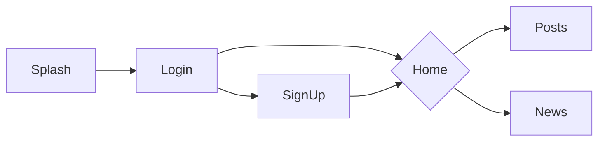
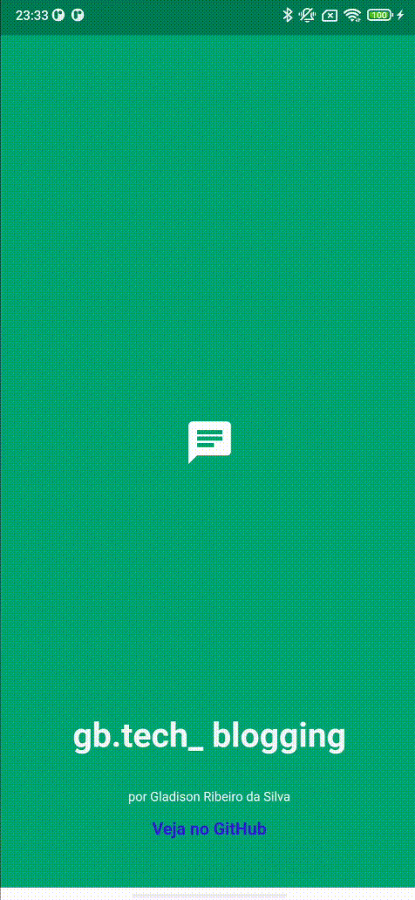

 
# gb.tech_.blogging

---

Repositório resultado do desafio técnico


## Objetivo

Implementar um microblogging onde os colaboradores possam compartilhar ideias e pensamentos do dia a dia e saber das últimas novidades do Grupo Boticário.

## Arquitetura

Foi aplicada uma arquitetura limpa com o código organizado em diretórios:

|Nome do diretório|Conteúdo|
|:--|:--|
|domain| Entidades e definição de interfaces|
|application| Casos de uso|
|infra| Implementações das interfaces, adaptadores, frameworks e drivers |
|presenter| Entradas, saídas e interações da aplicação|

## Testes

O desenvolvimento foi orientado por testes (TDD), começando pelo domínio e seguindo até chegar aos widgets, para executá-los utilize o comando ```flutter test```

## "Design System"
Foi criado um package [gbtech_blogging_ds](https://github.com/GladisonRibeiro/gb.tech_.blogging/tree/main/packages/gbtech_blogging_ds) para documentar e garantir a padronização do layout permitindo que seja utilizado dentro deste projeto e em outros projetos futuros:

|Nome do diretório| Conteúdo|
|:--|:--|
|tokens| colors, spacings, typography|
|components| button, textField|
|patterns| card, input |


## Telas e navegação


|Nome da Tela| Conteúdo|
|:--|:--|
|Splash| Ícone, nome do aplicativo e informações do desenvolvedor |
|Login| Inputs de e-mail e senha, botão entrar e botão cadastre-se |
|SignUp| Inputs de nome, e-mail, senha e botão continuar|
|Home| Navegação para telas de postagens e novidades|
|Posts| Lista de postagens e input para novo post |
|News|Lista das últimas novidades do Boticário|

## Resultado

<figure>
  
  <figcaption>Preview do app</figcaption>
</figure>

<br/>

Estou disponibilizando uma APK para facilitar os testes, [clique aqui para baixar](https://drive.google.com/file/d/1leLq0XBO-JflK1m1qWh3O6q-nbP1BsNL/view?usp=sharing)

Obs: É necessário que o smartphone esteja permitindo a instalação de apps de fontes desconhecidas.

## Como executar

No diretório raíz executar o comando `flutter pub get` para baixar as dependências e depois `flutter run`

Obs: Para rodar __web__ localmente é necessário remover a segurança, veja como realizar essa ação [aqui](https://stackoverflow.com/questions/65630743/how-to-solve-flutter-web-api-cors-error-only-with-dart-code/66879350#66879350) 

## Informações gerais sobre o app

### Versões
Flutter: sem restrições no projeto, instalada: 3.0.5
Dart: ">=2.17.6 < 3.0.0"

### Funcionamento

No momento o aplicativo funciona com repositórios em memória para o cadastro, login e postagens portanto ao sair do app os dados do usuário e suas postagens serão perdidos; Para os dados de novidades da Boticário o app utiliza um repositório http para obter os dados no endpoint fornecido. 

### Credencial para login

E-mail: gb.tech@blogging.io
Senha: abcd1234

## Dependências

| Nome                    | Descrição                                                       | Link                                                  | Versão  |
|-------------------------|-----------------------------------------------------------------|-------------------------------------------------------|---------|
| mocktail                | Biblioteca que simplifica a criaçao de mocks                    | https://pub.dev/packages/mocktail                     | ^0.3.0  |
| bloc_test               | Pacote que facilita os testes dos Bloc's                         | https://pub.dev/packages/bloc_test                    | ^9.0.3  |
| dartz                   | Adiciona programação funcional ao Dart                          | https://pub.dev/packages/dartz                        | ^0.10.1 |
| dio                     | Um cliente Http para Dart                                       | https://pub.dev/packages/dio                          | ^4.0.6  |
| gbtech_blogging_ds      | Disponibiliza componentes para layout                           | path: ./packages/gbtech_blogging_ds                   | 0.0.1   |
| flutter_modular         | Injeção de dependência e gerenciamento de rotas                 | https://pub.dev/packages/flutter_modular              | ^5.0.3  |
| modular_bloc_bind       | Fornece um Bind de Bloc com auto-dispose para o flutter_modular | https://pub.dev/packages/modular_bloc_bind            | ^1.0.1  |
| bloc                    | Pacote que simplifica a criação de Bloc's                       | https://pub.dev/packages/bloc                         | ^8.0.3  |  
| url_launcher            | Plugin Flutter para abrir uma URL                               | https://pub.dev/packages/url_launcher                 | ^6.1.5  |
| intl                    | Fornece recursos de internacionalização e localização           | https://pub.dev/packages/intl                         | ^0.17.0 |
| flutter_launcher_icons  | Simplifica atualizar o ícone                                    | https://pub.dev/packages/flutter_launcher_icons       | ^0.9.2  |

---

[](https://www.linkedin.com/in/gladisonribeirodasilva) [](mailto:gladison.ti@gmail.com)
